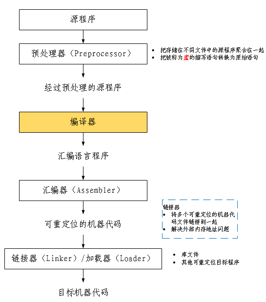
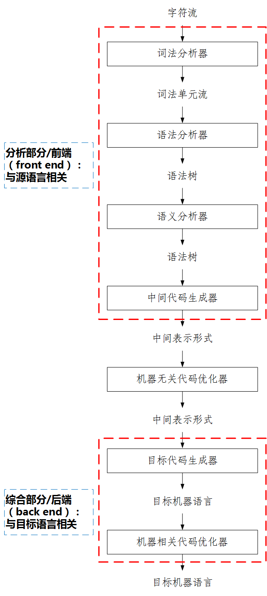
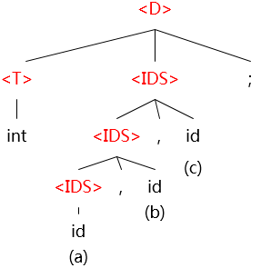

# 0. 编译器在系统中的位置

# 1. 编译系统的结构
```高级语言程序 --> 编译器 --> 机器代码```

# 2. 词法分析/扫描(Scanning)
## 2.1. 词法分析的任务
从左向右逐行扫描源程序的字符，识别出各个单词，确定单词的类型，并将识别出的单词转换成统一的机内表示——词法单元（**token**）形式
``` token : < 种别码，属性值> ```
|  |单词类型|种别|种别码|
|:-----:|:----:|:----:|:----|
|1|关键字|program、if、else、then……|一词一码|
|2|标识符|变量名、数组名、记录名、过程名……|多词一码|
|3|常量|整型、浮点型、字符型、布尔型……|一型一码|
|4|运算符|算术运算符、关系运算符、逻辑运算符|一词一码或一型一码|
|5|界限符|; ( ) = { } ...|一词一码|
- 例子：词法分析后得到的token序列
输入：```while(value != 100) {num++;}```
输出：  

    |No|字符|token|
    |:--:|:--:|:--:|
    |1|while|<WHILE, - >|
    |2|(|<SLP, - >|
    |3|value|<IDN, value >|
    |4|!=|<NE, - >|
    |5|100|<CONST, 100 >|
    |6|)|<SRP, - >|
    |7|{|<LP, - >|
    |8|num|<IDN, num >|
    |9|++|<INC, - >|
    |10|;|<SEMI, - >|
    |11|}|<RP, - >|

# 3. 语法分析
从词法分析器输出的token序列中**识别出各类短语**，并**构造语法分析树（Parse tree）**  
语法分析树描述了句子的语法结构  
- 例子：变量声明语句的分析树
```
文法：
<D> --> <T><IDS>;             
<T> --> int|real|char|bool
<IDS> --> id|<IDS>,id
```
输入 ```int a,b,c;```
输出：

# 4. 语义分析
## 收集标识符的属性信息
- 种属（Kind）：简单变量、复合变量（数组、记录……）、过程……
- 类型（Type）：整型、字符型、指针型、布尔型
- 存储位置、长度
- 值
- 作用域
- 参数和返回值信息
语义分析的结果将存在符号表（Symbol table）中。符号表是用于存放标识符的属性信息的数据结构。
## 语义检查
- 变量或过程未经声明就使用
- 变量或过程名声明重复
- 运算分量类型不匹配
- 操作符与操作数之间的类型不匹配，如数组下标不是整数、对非数组变量使用数组访问操作符、函数调用参数类型或数量不匹配
# 5. 中间代码生成和编译器后端
## 5.1. 中间代码生成
常用的中间表示形式
### 三地址码（Three-address Code）
三地址码由类似于汇编语言的指令序列组成，每个指令最多有三个操作数。
### 语法结构树
