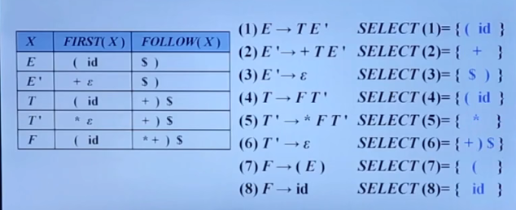

语法分析器从词法分析器获得一个由词法单元组成的串，并验证这个串可以由源语言的文法生成。我们期望语法分析器能够以易于理解的方式报告语法错误，并且能够从常见的错误中恢复并继续处理程序的其余部分。
# 1. 自顶向下的分析（Top-Down Parsing）
从分析树的顶部（根节点）向底部（叶节点）方向构造分析树，可以看成是从文法开始符号S**推导**出词串w的过程。    
  

- 每一步推导中 ，都需要做两个选择：
    - 替换当前句型中的**哪个非终结符**
    - 用该终结符的**哪个候选式**进行替换
### 最左推导（Left-most Derivation）
- 在最左推导中，总是选择每个句型的最左非终结符进行替换


从文法的开始符号，通过最左推导的方式得到的句型，称为是最左句型。
### 最右推导（Right-most Derivation）
- 在最右推导中，总是选择每个句型的最右非终结符进行替换


- 在自底向上的分析中，总是采用最左规约的方式，因此把**最左规约**称为**规范规约**，而最右推导相应地称为**规范推导**。

### 自顶向下的语法分析采用最左推导方式
- 总是选择每个句型的**最左非终结符**进行替换
- 根据输入流中的**下一个终结符**，选择最左非终结符的一个候选式

### 自顶向下语法分析的通用形式
- 递归下降分析（Recursive-Descent Parsing）
    - 由一组**过程**组成，每个过程对应一个**非终结符**（也就是说，文法中有多少个非终结符，就有多少个过程）
    - 从文法开始符号S对应的过程开始，其中递归调用文法中其他非终结符对应的过程。如果S对应的过程体恰好扫描了整个输入串，则成功完成语法分析
```
void A() {
    选择一个A的产生式， A->X1X2...Xk;
    for ( i = 1 to k) {
        if (Xi是一个非终结符号)
            调用过程Xi();
        else if (Xi等于当前的输入符号a)  // 即Xi是一个终结符
            读入下一个输入符号;
        else 
            // 错误处理
    }    
}
```
可能需要回溯，导致效率较低。如果分析过程中，我们能够预测出正确的产生式，则可以不必回溯，即预测分析
### 预测分析
- 预测分析是递归下降分析技术的一个特例，通过在输入中向前看**固定个数**（通常是1）符号，来选择正确的A-产生式。
    - 可以对某些文法构造出向前看k个输入符号的预测分析器，该类文法有时也成为了```LL(k)```文法类
- 预测分析**不需要回溯**，是一种确定的自顶向下分析方法

# 2. 文法转换
并不是所有的文法都适合自顶向下分析，有时候我们需要改造文法，使其适合使用自顶向下分析。
- 例1，有如下文法G。当输入为```abc```时，同一非终结符的多个候选式存在共同前缀，将导致回溯现象
```
S -> aAd | aBe
A -> c
B -> b
```
- 例2， 有如下文法G：
```
E -> E+T | E-T | T
T -> T*F | T/F | F
F -> (E) | id
```
对于输入```id + id * id```，采用最左推导时，由于产生式的右边与开始符号相同，将导致无限循环替换
```
E -> E + T
  -> E + T + T
  -> E + T + T + T
  -> ....
```
含有```A->Aα```形式的文法称为是**直接左递归**的。如果一个文法中有一个非终结符A使得对某个串```α```存在一个推导```A -> +Aα```，那么这个文法就是左递归的。经过两步或两步以上推导产生的左递归称为是**间接左递归**的。左递归文法会使递归下降分析器陷入无限循环。
## 消除直接左递归的一般形式
$A → Aα1|Aα2|...|Aαn|β1|β2|...|βn (αi≠ε, βj不以A开头)$  
转换为：  
$A → β1A'|β2A'|...|βmA'$  
$A' → α1A'|α2A'|...|αnA'|ε$  
消除左递归是要付出代价的——引进了一些非终结符和空产生式

# 3. LL(1)文法
## 3.1. S_文法
- 预测分析法的工作过程
    - 从文法开始符号除法，在每一步推导过程中根据当前句型的最左非终结符A和当前输入符号a，选择正确的A-产生式。为保证分析的确定性，选出的候选式必须是唯一的
- S_文法（简单的确定性文法）
    - 每个产生式的右部都以**终结符**开始
    - 同一非终结符的各个候选式的**首终结符**都不同
    - S_文法不包含空产生式

  
- 什么时候可以使用空产生式？
    - 如果当前某**非终结符A**与当前**输入符a**不匹配时，若**存在```A->ε```，可以通过检查a是否可以出现在**A的后面**，来决定**是否可以使用产生式```A->ε```（若文法中没有```A->ε```，则应报错）
## 3.2. 非终结符的后继符号集
- **非终结符A的后继符号集**
    - 可能在某个句型中紧跟在A后边的终结符a的集合，极为```FOLLOW(A)```  
```FOLLOW(A)={a| S=>*αAaβ, a∈VT, α,β∈(VT∪VN)*}```   

如果A是某个句型的最右符号，则将结束符```$```添加到FOLLOW(A)

- **产生式的可选集**：产生式```A->β```的可选集是指可以选用该产生式进行推导时对应的输入符号的集合，记为```SELECT(A->β)```  
    - ```SELECT(A->aβ) = {a}```，即如果产生式紧跟一个终结符，那么该产生式的可选集为该终结符
    - ```SELECT(A->ε) = FOLLOW(A)```，即空产生式的可选集为紧跟在A后边的终结符a的集合FOLLOW(A)

- q_文法
    - 每个产生式的右部或为ε，或**以终结符开始**
    - 具有相同左部的产生式有**不相交的可选集**
    - q_文法不含右部以**非终结符**打头的产生式  
### 串首终结符
- 串首第一个符号，并且是终结符，称为首终结符
- 给定一个文法符号串α，α的**串首终结符集FIRST(α)**被定义为可以从α推导出的所有串首终结符构成的集合。如果```α ->* ε```，那么ε也在FIRST(α)中
- 产生式```A->α```的可选集SELECT
    - 如果```ε ∉ FIRST(α)```，那么```SELECT(A->α) = FIRST(α)```
    - 如果```ε ∈ FIRST(α)```，那么```SELECT(A->α) = (FIRST(α)-{ε})⋃ FOLLOW(A) ```
## 3.3. LL(1)文法
- 文法G是LL(1)的，当且仅当G的任意两个具有相同左部的产生式```A -> α|β```满足下面的条件：
    - 如果α和β均不能推导出ε，则```FIRST(α) ⋂ FIRST(β) = ∅```
    - α和β至多有一个能推导出ε
    - 如果```β =>* ε```，则```FIRST(α) ⋂ FOLLOW(A) = ∅```
    - 如果```α =>* ε```，则```FIRST(β) ⋂ FOLLOW(A) = ∅```
    -（同一非终结符的各个产生式的可选集互不相交）
- LL(1)文法的含义：
    - 第一个L：从左向右扫描输入
    - 第二个L：产生最左推导
    - 1：每一步中只需要向前看一个输入符号来决定语法分析的动作
## 3.4. 计算文法符号X的FIRST(X)
- FIRST(X)：可以从X推导出的所有串首终结符构成的集合。注意，**FIRST集看产生式的左边**
- 如果```X =>* ε```，那么```ε ∈ FIRST(X)```  

.png)  

例2：求如下文法每个非终结符的FIRST集：
```
G[S]: S -> aH      FIRST集：First(S) = {a}
      H -> aMd              First(H) = {a,d}
      H -> d                First(M) = {a,e,ε}
      M -> Ab               First(A) = {a,e}
      M -> ε
      A -> aM
      A -> e
```
### 算法
不断应用下列规则，直到没有新的**终结符**或**ε**可以被加入到任何FIRST集合中为止
- 如果X是一个终结符，那么FIRST(X) = {X}
- 如果X是一个非终结符，且```X -> Y1...Yk ∈ P(k≥1)```，那么如果对于某个i，a在FIRST(Yi)中且ε在所有的FIRST(Y1)，...，FIRST(Yi-1)中（即```Y1Y2...Yi-1 =>* ε```），就把a加入到FIRST(X)中。如果对于所有的j=1,2,...,k，ε在FIRST(Yj)中，那么将ε加入到FIRST(X)
- 如果```X->ε∈P```，那么将ε加入到FIRST(X)中  
### 计算X1X2...Xn的FIRST集合
- 向FIRST(X1X2...Xn)加入FIRST(X1)中所有的非ε符号
- 如果ε在FIRST(X1)中，再向FIRST(X1X2...Xn)加入FIRST(X2)中所有的非ε符号；如果ε在FIRST(X1)和FIRST(X2)中，再向FIRST(X1X2...Xn)加入FIRST(X3)中所有的非ε符号，以此类推
- 最后，如果对所有的i，ε都在FIRST(Xi)中，那么将ε加入到FIRST(X1X2...Xn)中
## 3.5. 计算非终结符A的FOLLOW(A)
可能在某个句型中紧跟在A后边的终结符a的集合，极为```FOLLOW(A)```    
```FOLLOW(A)={a| S=>*αAaβ, a∈VT, α,β∈(VT∪VN)*}```   

注意，FOLLOW集看产生式的右边  
- 1. 文法开始符号，其FOLLOW集必有```$```
- 2. ```A->αB```，求FOLLOW(B)，如果B后为空，则将FOLLOW(A)加入到FOLLOW(B)中
- 3. ```A->αBβ```，
    - β是终结符，将β直接写下来
    - β是非终结符，将FIRST(β)（除空串）加入到FOLLOW(B)中，
### 算法
不断应用下列规则，直到没有新的终结符可以被加入到任何FOLLOW集合中为止
- 将```$```放入FOLLOW(S)中，其中S是文法开始符号，```$```是输入右端的结束标记
- 如果存在一个产生式```A->αBβ```，那么FIRST(β)中**除ε之外**的所有符号都在FOLLOW(B)中
- 如果存在一个产生式```A->αB```，或存在产生式```A->αBβ```并且FIRST(β)包含ε，那么FOLLOW(A)中的所有符号都在FOLLOW(B)中

.png)  

推荐视频：https://www.bilibili.com/video/BV1Cu411m7VX/?spm_id_from=pageDriver&vd_source=950d4bedf3ff9f614b11c23c95c49342
## 3.6. 表达式文法各个产生式的SELECT集
  

LL(1)文法，根据每个产生式的SELECT集，可以构造文法的**预测分析表**  


# 4. 递归的预测分析法
**递归的预测分析法**是指：在**递归下降分析**中，编写每一个非终结符对应的过程时，根据**预测分析表**进行产生式的选择
```
void A() {
    选择一个A产生式，A->X1X2...Xk
    for (i = 1 to k) {
        if (Xi是一个非终结符号)
            调用过程Xi()
        else if (Xi等于当前输入符号a)
            读入下一个输入符号
        else // 发生了一个错误
    }
}
```
# 5. 非递归的预测分析法
**非递归的预测分析法**是指：不需要为每个非终结符**编写递归下降过程**，而是根据预测分析表构造一个自动机，也叫表驱动的预测分析  


# 6. 预测分析法实现步骤
- 1. 构造文法
- 2. 改造文法：消除二义性、消除左递归、消除回溯
- 3. 求每个变量的FIRST集和FOLLOW集，从而**求得每个候选式的SELECT集**
- 4. 检查是不是LL(1)文法。若是，**构造预测分析表**
- 5. 对于**递归的**预测分析，根据预测分析表为每一个非终结符编写一个过程；对于**非递归**的预测分析，实现表驱动的预测分析算法
## 预测分析中的错误检测
两种情况夏可以检测到错误：
- 栈顶的**终结符**和当前**输入符号**不匹配
- 栈顶**非终结符**与当前**输入符号**在预测分析表中对应项中的信息为空
### 恐慌模式
- 忽略输入中的一些符号，直到输入中出现由设计者选定的**同步词法单元**集合中的某个词法单元
- 如果终结符在栈顶而不能匹配，一个简单的办法就是弹出此终结符

# 7. 自底向上的语法分析
- 从分析树的底部向顶部方向构造分析树，可以看成是将输入串w规约为文法开始符号S的过程
- 自顶向下的语法分析采用的是最左推导方式，而自底向上的语法分析采用最左规约方式
- 自底向上语法分析的通用框架：移入-规约分析  


栈内符号串 + 剩余输入 = “规范句型”  


### 移入-规约分析的工作过程
- 在对输入串的一次从左到右扫描过程中，语法分析器将零个或多个输入符号**移入**到**栈**的顶端，直到它可以对栈顶的一个文法符号串```β```进行**规约**为止
- 然后，它将```β```**规约**为某个产生式的右部
- 语法分析器不断重复这个循环，直到它检测到一个语法错误，或者栈中包含了开始符号且输入缓冲区为空（当进入这样的格局时，语法分析器停止运行，并宣称成功完成了语法分析）为止

### 移入-规约分析器可采取的4种动作
- 移入：将下一个输入符号移到栈的顶端
- 规约：被规约的符号串的右端必然处于栈顶。语法分析器在栈中确定这个串的左端，并决定用哪个非终结符来替换这个串
- 接收：宣布语法分析过程成功完成
- 报错：发现一个语法错误，并调用错误恢复子例程