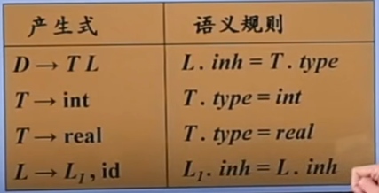
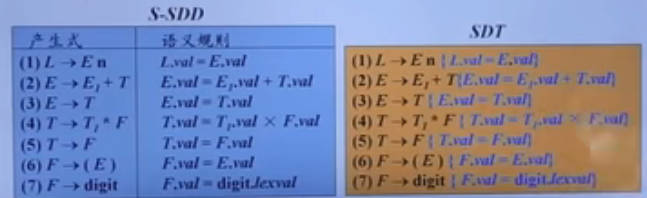

语义分析和中间代码生成称为语义翻译，语法分析+语义翻译合称为语法制导翻译。语法制导翻译使用上下文无关文法（Context-free Grammar，CFG）来引导对语言的翻译，是一种面向文法的翻译技术。
# 语法制导翻译的基本思想
- 如何表示语义信息？为CFG中的**文法符号**设置**语义属性**，用来表示语法成分对应的**语义信息**
- 如何计算语义属性？
    - 文法符号的语义属性值是与用文法符号所在产生式（**语法规则**）相关联的**语义规则**来计算的
    - 对于给定的输入串x，构建x的语法分析树，并利用与产生式（**语法规则**）相关联的**语义规则**来**计算**分析树中各个结点对应的**语义属性值** 
- 将**语义规则**同**语法规则**（产生式）联系起来要涉及两个概念
    - 语法制导定义（Syntax-Directed Definition，SDD）
    - 语法制导翻译方案（Syntax-Directed Translation Scheme，SDT）
## 语法制导定义
SDD是对CFG的推广： 
- 将每个**文法符号**和一个**语义属性**集合关联起来
- 将每个**产生式**和一组**语义规则**相关联，这些规则用于计算该产生式中各文法符号的属性值  

如果X是一个文法符号，a是X的一个属性，则用X.a表示属性a在某个标号为X的分析树结点上的值  

## 语法制导翻译方案
SDT是在产生式右部嵌入了**程序片段**的CFG，这些程序片段称为**语义动作**。按照惯例，语义动作放在花括号内。    
  
一个语义动作在产生式中的位置决定了这个动作的执行时间
## SDD与SDT
- SDD是关于语言翻译的高层次规格说明，隐蔽了许多具体实现细节，使用户不必显式说明翻译发生的顺序
- SDT可以看作是对SDD的一种补充，是SDD的具体实施方案，显式地知名了语义规则的计算顺序，以便说明某些实现细节
# 语法制导定义SDD
SDD是对CFG的推广： 
- 将每个**文法符号**和一个**语义属性**集合关联起来
- 将每个**产生式**和一组**语义规则**相关联，这些规则用于计算该产生式中各文法符号的属性值   

文法符号的属性分为综合属性和继承属性
## 综合属性
在分析树结点N上的非终结符A的综合属性只能通过N的子结点或N本身的属性值来定义。  
  
上图中，E的val属性值由E1的属性值和T的属性值确定，所以val是E的综合属性。  

终结符可以具有综合属性。终结符的综合属性值是由词法分析器提供的**词法值**，因此在SDD中没有计算终结符属性值的语义规则。
## 继承属性
在分析树结点N上的非终结符A的继承属性只能通过N的父节点、N的兄弟结点或N本身的属性值来定义。  
  
上图中，L的inh属性只能通过其兄弟结点T来定义，所以inh属性是L的继承属性（inherited）

终结符没有继承属性。终结符从词法分析器中获得的属性值被归为综合属性值。  

  


## 属性文法
一个没有副作用的SDD有时也成为属性文法。属性文法的规则仅仅通过其他属性值和常量来定义一个属性值。

## SDD的求值顺序
SDD为CFG中的文法符号设置语义属性。对于给定的输入串x，应用语义规则计算分析树中各结点对应的属性值。那么，应该按照什么顺序计算属性值？---- 语义规则建立了**属性之间的依赖关系**，在对语法分析树节点的一个属性求值之前，必须首先求出这个属性值**所依赖的所有属性值**  

### 依赖图（Dependency Graph）
- 依赖图是一个描述了分析树中结点属性间依赖关系的有向图
- 分析树中每个标号为X的结点的每个属性a都对应着依赖图中的一个结点
- 如果属性X.a的值依赖于属性Y.b的值，则依赖图中有一条从Y.b的结点指向X.a的结点的有向边  

  

根据属性的依赖可以得到属性值的计算顺序。这样是排序将一个有向图变成了一个线性排序，这个排序称为这个图的**拓扑排序**。  
  

对于只具有**综合属性**的SDD，可以按照任何自底向上的顺序计算它们的值。对于同时具有**继承属性**和**综合属性**的SDD，**不能保证存在一个顺序**来对各个节点上的属性进行求值。  

## S-属性定义与L-属性定义
### S-属性定义
仅仅使用**综合属性**的SDD称为是S属性的SDD，或S-属性定义、S-SDD。如果一个SDD是S属性的，可以按照语法分析树节点的任何**自底向上**顺序来计算它的各个属性值。所以，S-属性定义可以在**自底向上的语法分析**过程中实现。
### L-属性定义
L-属性定义（也称L属性的SDD或L-SDD）的直观含义：在一个产生式所关联的各个属性之间，依赖图的边可以从左到右，但不能从右到左（因此称为L属性的，L是left的首字母）  

- 正式定义：一个SDD是L-属性定义，当且仅当它的每个属性要么是一个综合属性，要么是满足如下条件的继承属性：假设存在一个产生式```A->X1X2...Xn```，其右部符号Xi（1<=i<=n）的继承属性仅依赖于下列属性：
    - A的继承属性
    - 产生式中Xi左边的符号X1,X2,...,Xi-1的属性
    - Xi本身的属性，但Xi的全部属性不能在依赖图中形成环路


每个S-属性定义都是L-属性定义
# 语法制导翻译方案SDT
SDT是在产生式右部嵌入了**程序片段**的CFG，这些程序片段称为**语义动作**。
## 将S-SDD转换为SDT
- 将一个S-SDD转换为SDT的方法：将每个语义动作都放在产生式的最后  

  

