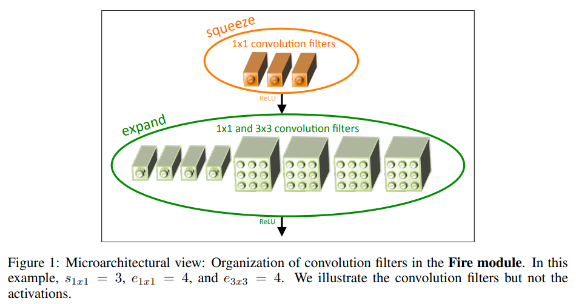

# 1. 介绍
现有的关于CNN的研究大部分聚焦于提高网络的精度。对于检测/识别精度相同的多个神经网络而言，小型/轻量型的CNN网络具有如下3个优点：
- 分布式训练中，较小的 CNN,意味各个分布式子系统之间通讯量会减少，有助于提高训练性能
- 较小的 CNN 有助于减少云端的传输压力，因为较小的 CNN 数据量更少，节约了用户下载时间，也节省了流量
- 较小的 CNN 更容易部署在 FPGA 这样内存受限的硬件上  

SqueezeNet是一款轻量级的神经网络，在达到AlexNet网络精度的基础上，其参数只有AlexNet的1/50。如果采用模型压缩技术，甚至可以将SqueezeNet压缩至0.5M！

# 2. SqueezeNet设计策略
文章采用了如下3个设计策略：
- **使用1x1的卷积核替代3x3的卷积核**。1x1的卷积核的参数是3x3的卷积核的训练参数的1/9
- **减少3x3卷积核的input通道数**。卷积层的参数数量 = 输入通道数 x 卷积核数量 x (3x3)。文章采用squeeze layer来减少3x3卷积核的input通道数
- **延迟下采样**。延迟下采样的好处就是卷积核进行卷积后，可以产生比较大的feature map.

# 3. Fire Module  
SqueezeNet的基本模块叫做**Fire Module**。Fire Module由一个squeeze layer（1x1的卷积核），和一个expand layer（1x1和3x3卷积核的组合）组成。



Fire Module有3个超参数：
- s1x1：squeeze layer的1X1卷积核个数
- e1x1：expand layer的1x1的卷积核个数
- e3x3：expand layer的3x3的卷积核个数

使用Fire Module时，控制```s1x1 < (e1x1 + e3x3)```，即策略2。

# 4. SqueezeNet网络结构
  

SqueezeNet有8个Fire Module模块，而每个模块有3个超参数，所以它总共有24个超参数。参考ResNet的结构，借鉴了bypass的思想，设计了3个网络对比。

