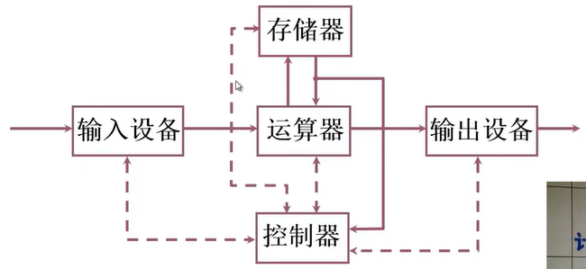
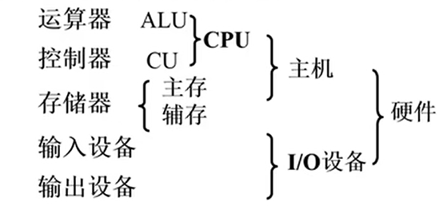

# 计算机的基本组成
**数据和程序都以二进制的形式存放在计算机中**，这种结构的计算机称为冯诺依曼计算机。
## 冯诺依曼计算机的特点
- 1. 计算机由五大部件组成
- 2. 指令和数据以同等地位存于存储器，可按地址寻访
- 3. 指令和数据用二进制表示
- 4. 指令由操作码和地址码组成
- 5. 存储程序：程序存放在存储器中
- 6. 以运算器为中心

### 存储器的基本组成
存储体 - 存储单元 - 存储元件(0/1)

- 存储单元存放一串二进制代码
- 存储字：存储单元中二进制代码的组合
- 存储字长：存储单元中二进制代码的位宽，每个存储单元赋予一个地址
- 存储单元按地址寻访

#### MAR——存储器地址寄存器
MAR反应存储单元的个数。MAR保存了存储单元的地址。
#### MDR——存储器数据寄存器
MDR反应存储字长。保存了要送给CPU的数据，或者保存要送给存储器的数据，或是保存刚从存储体中取出来的数据。

假设MAR=4 bit，MDR=8 bit，则存储单元个数为16个，存储字长为8位。