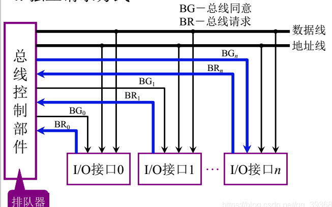

# 1. 总线的基本概念
#### 为什么要使用总线？
冯诺依曼计算机中，计算机由运算器、控制器、存储器、输入/输出设备组成。需要使用总线将各个部件连接起来，才能组成一个完成的系统。
#### 什么是总线？
总线是连接各个部件的信息传输线，是各个部件共享的传输介质。
#### 总线上信息的传送
- 串行方式
- 并行方式：需要多条数据线进行传输，距离长时，信号之间会有干扰。所以并行传输线路较短。
# 2. 总线的分类
- 片内总线：芯片内部的总线
- 系统总线：计算机各个部件之间的信息传输线  
    - 数据总线：双向，与机器字长、存储字长相关，数据总线字长<=机器字长
    - 地址总线：单向，与存储地址、IO地址有关
    - 控制总线：有出有入，存储器读、存储器写、总线许可、中断确认、中断请求、总线请求
- 通信总线：用于计算机系统之间或者计算机系统与其他系统之间的通信（串行、并行）
# 3. 总线的结构

# 4. 总线控制
## 总线判优控制
### 基本概念
- 主设备：对总线有控制权
- 从设备：相应从主设备发来的总线命令

总线判优控制分为集中式和分布式
- 集中式：
    - 链式查询
    - 计数器定时查询
    - 独立请求方式

#### 链式查询方式
  

在查询链中离总线控制器最近的部件具有最高优先权，离总线控制器越远，优先权越低。链式查询通过接口的优先权排队电路实现。
- 优点：结构简单，主要运用在简单的嵌入式系统中
- 缺点：速度慢，需要一直向下查询，对电路故障特别敏感

#### 计数器定时查询

计数器的初值可用程序设置，以方便地改变优先次序。当然这种灵活性是以增加控制线数为代价的如果计数器的初值是从0开始，各部件的优先次序与链式查询法相同。如果从中止点开始，则每个设备使用总线的优先级相等。

#### 独立请求方式

- 优点：响应时间快，对优先次序的控制相当灵活  
- 缺点：控制线数增加了很多

## 总线通信控制
总线通信控制是为了解决通信双方协调配合问题。

### 总线传输周期
- 申请分配阶段：主设备申请，总线仲裁决定
- 寻址阶段：主设备向从设备给出地址和命令
- 传输阶段：主设备和从设备交换数据
- 结束阶段：主设备撤销有关信息

### 总线通信的4种方式
- 同步通信：由统一时标控制数据传送
- 异步通信：采用应答方式，没有公共时钟标准
- 半同步通信：同步、异步结合
- 分离式通信：充分挖掘系统总线每个瞬间的潜力

