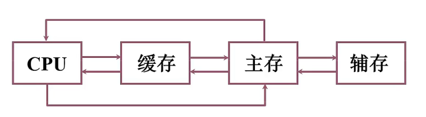
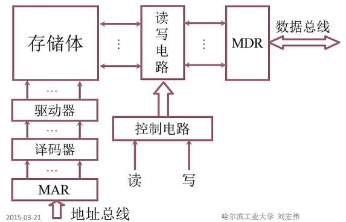
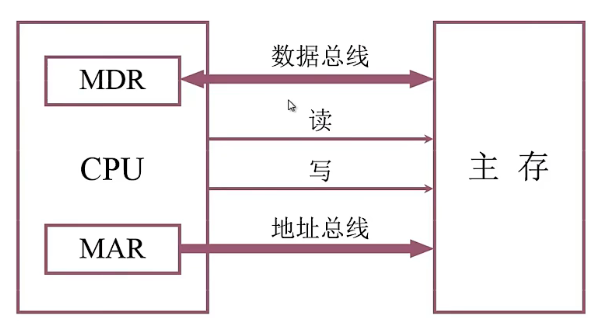
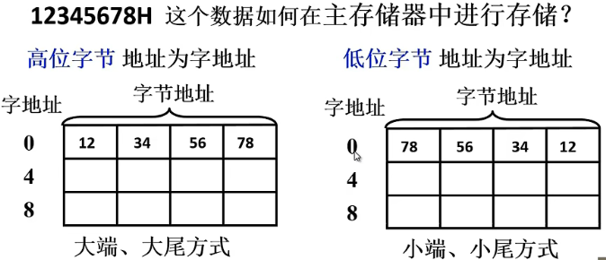
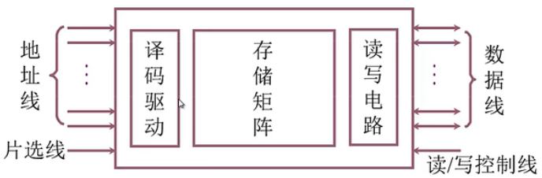
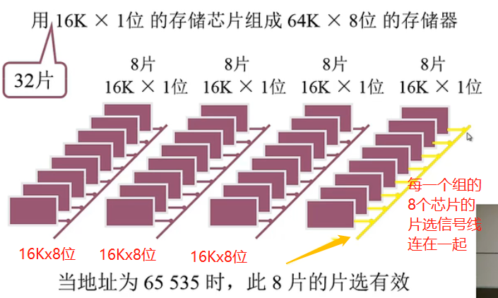
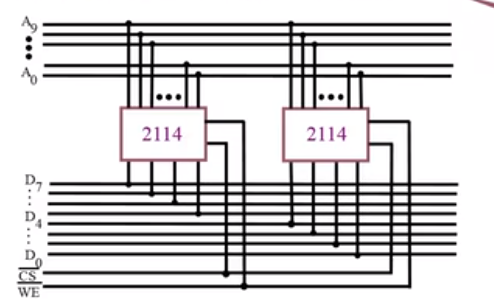
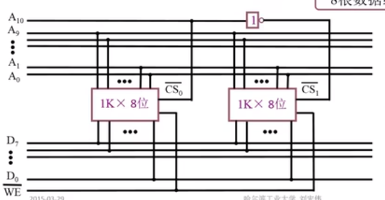
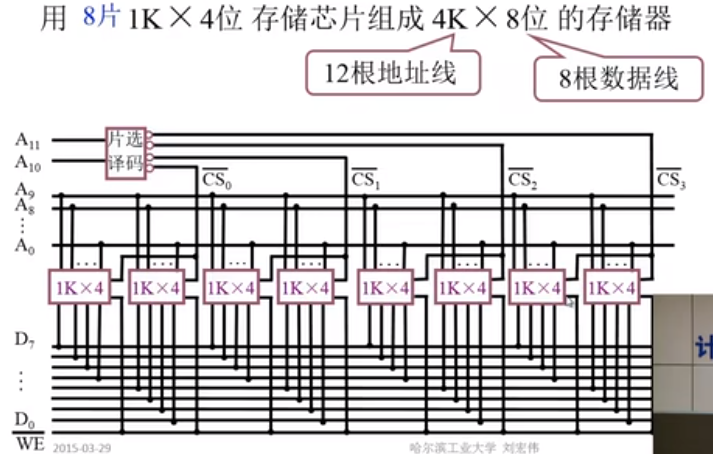
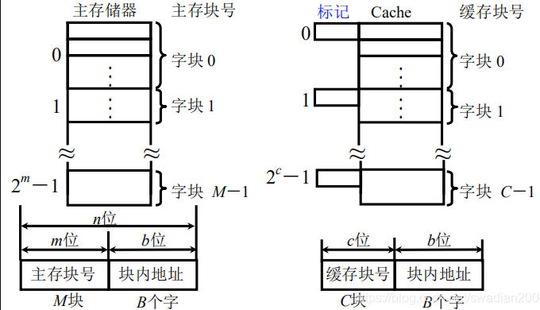

# 1. 概述
## 存储器的分类
### 按存储介质分类
- 半导体存储器 TTL、MOS，易失
- 磁表面存储器 磁头、磁载体，非易失
- 磁心存储器，非易失
- 光盘存储器 激光、磁光材料，非易失
### 按存取方式分类
- 存储时间与物理地址无关（随机访问）
    - 随机存储器：在程序的执行过程中可读可写
    - 只读存储器：在程序的执行过程中只读
- 存取时间与物理地址有关（串行访问）
    - 顺序存取存储器：磁带
    - 直接存取存储器：磁盘
### 按在计算机中的作用分类
- **主存储器**：
    - RAM：静态RAM和动态RAM
    - ROM：MROM、PROM、EPROM、EEPROM
- **Flash Memory**：便携式存储器，或作为计算机的硬盘，或作为辅助存储器的缓存
- **高速缓冲存储器**（Cache）
- **辅助存储器**：磁盘、磁带、光盘

## 存储器的层次结构

# 2. 主存储器
## 2.1. 主存储器概述
### 2.1.1. 主存的基本组成
 
### 2.1.2. 主存和CPU的关系
  
### 2.1.3. 主存中存储单元地址的分配
  

假设地址线24根，按字节寻址，$2^{24} = 16 MB$  
若字长为16位，按字寻址，8MW
若字长为32位，按字寻址，4MW  
## 2.2. 半导体存储芯片简介
### 2.2.1. 半导体存储芯片基本结构

- 外部设备给出要读或者写的存储单元地址
- 经过译码驱动电路，选择指定存储单元，完成存取操作
- 片选线：给出访问内容是否在当前存储芯片当中
- 读写控制线：本次对芯片的操作是读操作还是写操作  

### 2.2.2. 半导体存储芯片的译码驱动方式
- 线选法
- 重合法
## 2.3. 随机存取存储器（RAM）
### 2.3.1. 静态RAM（SRAM）
### 2.3.2. 动态RAM（DRAM）

## 2.4. CPU与存储器的连接
## 2.4.1. 存储器容量的扩展
### 位扩展（增加存储字长）
例，用 1K x 4bit 存储芯片组成 1K x 8bit的存储器（10根地址线组成1K个存储单元，8根数据线表示存储字长为8bit）  
  

两个芯片的片选信号连接在一根线上。

### 字扩展（增加存储字的数量）
例，用 1K x 8bit的存储芯片组成 2K x 8bit的存储器  

### 字、位扩展
例，用8片 1K x 4bit的存储芯片组成 4K x 8bit的存储器    
  

## 2.3.2. 存储器和CPU的连接
- 地址线的连接：一般将地址的低位作为地址送入存储器中，高位作为片选信号
- 数据线的连接：CPU的数据线条数可能比存储器的数据线条数更多，所以需要字扩展存储器
- 读写命令线的连接
- 片选线的连接：存储器的访问信号要在片选线中体现
- 合理选择存储芯片：保存系统程序、配置信息，选择ROM。用户程序等选择RAM。芯片数量尽可能少、片选逻辑尽可能简单。
- 其他：时序、负载 

## 2.5. 存储器的校验
问题：为什么要对存储器的信息进行校验？  
答：内存是电子设备，信息保存在电容中，如果内存所处的环境比较复杂，可能会造成电容的充放电造成影响，破坏存储内容。  
### 2.5.1. 编码的最小距离
编码距离：任意两组合法代码之间的二进制位数的最少差异。  
编码的纠错、检错能力与编码的最小距离有关。  
$$ L - 1 = D + C (D>=C) $$  
其中，
* L —— 编码的最小距离 
* D —— 检测错误的位数 
* C —— 纠正错误的位数 

### 2.5.2. 汉明码的组成
汉明码是一种具有1位纠错能力的编码。汉明码采用奇偶校验，分组校验。  
（参考博客：https://blog.csdn.net/qq_19782019/article/details/87452394）  

## 2.6. 提高访存速度的措施
- 采用高速器件
    - SDRAM（同步DRAM），在系统时钟的控制下进行读出和写入
    - RDRAM
    - 带Cache的DRAM
- 采用层次结构Cache-主存
- 调整主存结构

# 3. 高速缓冲存储器
## 3.1. 概述
为什么需要使用高速缓冲存储器？
高速缓冲存储器(Cache)实际上是为了把由DRAM组成的大容量内存储器都看做是高速存储器而设置的小容量局部存储器，一般由高速SRAM构成。这种局部存储器是面向CPU的，引入它是为**减小或消除CPU与内存之间的速度差异对系统性能带来的影响**。Cache 通常保存着一份内存储器中部分内容的副本(拷贝)，该内容副本是最近曾被CPU使用过的数据和程序代码。  

在计算机技术发展过程中，主存储器存取速度一直比中央处理器操作速度慢得多，使中央处理器的高速处理能力不能充分发挥，整个计算机系统的工作效率受到影响。  

高速缓冲存储器的容量一般只有主存储器的几百分之一，但它的存取速度能与中央处理器相匹配。根据程序局部性原理，正在使用的主存储器某一单元邻近的那些单元将被用到的可能性很大。因而，当中央处理器存取主存储器某一单元时，计算机硬件就自动地将包括该单元在内的那一组单元内容调入高速缓冲存储器，中央处理器即将存取的主存储器单元很可能就在刚刚调入到高速缓冲存储器的那一组单元内。于是，中央处理器就可以直接对高速缓冲存储器进行存取。  

## 3.2. Cache的工作原理
主存与缓存按块存储，块的大小相同，块内地址相同。

cache的结构其实和内存的结构类似，也包含地址和内容，只是cache的内容除了存的数据（data）之外，还包含存的数据的物理内存的地址信息（tag），因为CPU发出的寻址信息都是针对物理内存发出的，所以cache中除了要保存数据信息之外，还要保存数据对应的地址，这样才能在cache中根据物理内存的地址信息查找物理内存中对应的数据。（当然为了加快寻找速度，cache中一般还包含一个有效位（valid），用来标记这个cache line是否保存着有效的数据）。一个tag和它对应的数据组成的一行称为一个cache line。如下图所示，下表中的一行就是一个cache line。  
  

### Cache命中率
主存和缓存 按块存储，块的大小相同；缓存共有 C 块，主存共有 M 块 ，主存 M 块的数量>>(远远大于) 缓存 C块的数量。  

- 命中：主存块调入缓存，主存块与缓存块建立了对应关系，用**标记记录**与某缓存块建立了对应关系的主存块号
- 未命中：主存块与缓存块未建立对应关系，主存块未调入缓存
- Cache 的命中率：CPU欲访问的信息在Cache中的比率，命中率与Cache的容量与块长有关

