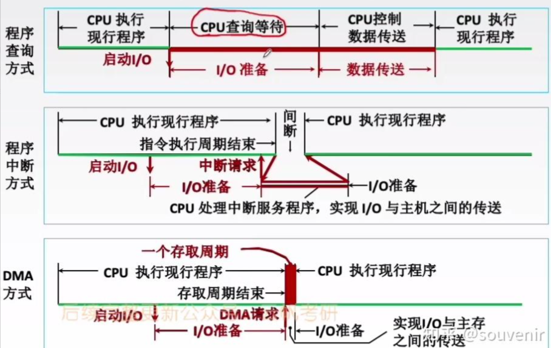
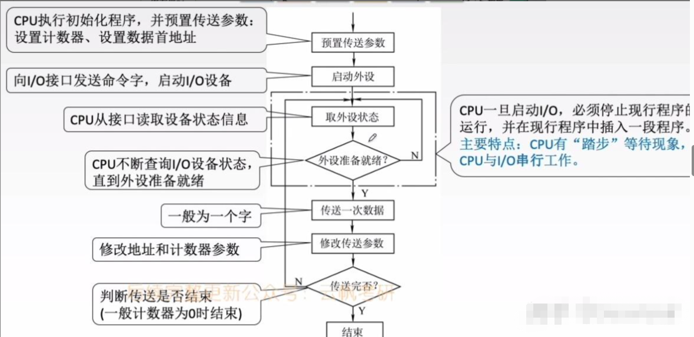
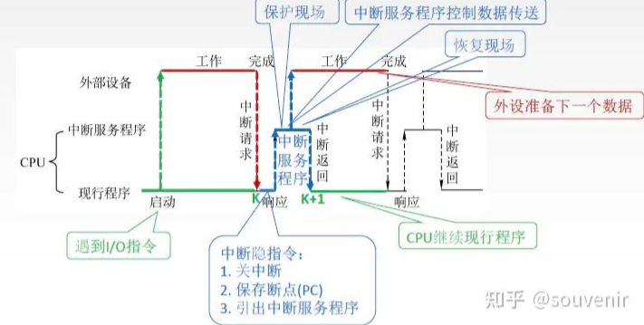

# 1. IO概述
IO接口是将外设连接到总线上的一组逻辑电路的总称，也称为外设接口。  

## 1.1. ID接口的功能及组成
### IO接口要解决的问题
- 速度匹配问题：CPU速度很快，而外设的速度有高有低，不同的外设速度差异很大
- 信号电平和驱动能力问题：CPU的信号都是TTL电平（一般0~5V之间），而且提供的功率很小，而外设需要的电平比这个范围宽的多，需要的驱动功率也较大
- 信号形式匹配问题：CPU只能处理数字信号，外设的信号形式多种多样，有数字量、开关量、模拟量（电流、电压、频率、相位，甚至还有非电量，如压力、流量、速度等）
- 信息格式问题：CPU在系统总线传送的是8位、16位或32位并行二进制数据，外设提供的可能是串行数据，也可能是任意位的并行数据，所以必须有相关部件完成信息格式转换
- 时序匹配问题：CPU的各种操作都是在统一的时钟信号作用下完成的，各种操作都有自己的总线周期。外设也有自己的定时与控制逻辑，大都与CPU时序不一致

### IO接口的功能
- IO地址译码与设备选择
- 信息输出输入
- 命令、数据和状态的缓冲与锁存
- 信息转换
- 实现控制逻辑
### IO系统的组成
1. IO软件
- I/O指令：CPU指令的一部分    

| part1 | part2 | part3 |
| :--: | :--: | :--: |
|操作码|命令码|设备码|

- 通道指令：通道自身的指令，指出数组的首地址、传送字数、操作命令

2. IO硬件：设备、IO接口
## 1.2. IO设备与主机的联系方式
### IO设备编址方式
（1）统一编址：IO端口与内存单元统一编址，当作一个内存单元看待，CPU可以直接使用取数、存数指令。
- 优点：
    - 不需要专门的输入/输出指令，所有访存指令都可直接访问端口，程序设计灵活性高
    - 端口有较大的编址空间
    - 读写控制逻辑电路简单
- 缺点：
    - 端口占用了主存地址空间，使主存地址空间变小
    - 外设寻址时间长（地址位数多，地址译码速度慢）  

（2）IO端口独立编址：内存地址空间和外设地址空间是相互独立的。有专用的IO指令  
- 优点：
    - 使用专用I/O指令，程序编制清晰
    - I/O端口地址位数少，地址译码速度快
    - I/O端口的地址不占用主存地址空间
- 缺点：
    - I/O指令类型少，一般只能对端口进行传送操作，程序设计灵活性差
    - 需要CPU提供存储器读/写、I/O设备读/写两组控制信号，增加了控制逻辑电路的复杂性
### 设备选址
使用设备选择电路识别某设备是否被选中
### 数据传送方式
串行和并行

# 2. IO控制方式

## 2.1. 程序查询方式

以打印3个字符为例 解释程序查询方式流程：  
- 1. CPU通过地址线指明Rn+1寄存器地址，控制线指明此次为写操作，将打印对应的命令字（如：00010）放入数据线上。通过OUT指令完成。
- 2. I/O控制逻辑电路根据命令字，给打印机发出命令信号。打印机启动。
- 3. 打印机启动完成后，通过状态线给I/O接口反馈。I/O控制逻辑电路将Ready（如：0010）存入状态/控制寄存器中。
- 3. CPU轮询检查（通过IN指令）状态/控制寄存器是否已经Ready。是Ready就开始传送数据。
- 4. CPU通过地址线指明此次要操作的是Rn端口，控制线指明此次为写操作，将打印对应的数据a放入数据线上。通过OUT指令完成。
- 5. I/O控制逻辑把数据缓冲寄存器的数据发送给外设打印机，同时发出相应的控制信号 。
- 6. 当打印机完成打印，I/O控制逻辑收集外设状态（Ready）到状态寄存器
- 7. CPU轮询检查（通过IN指令）状态/控制寄存器是否已经Ready。是Ready就开始传送下一个数据b。

- 主要特点：CPU有“踏步”等待现象，CPU与I/O串行工作
- 优点：接口设计简单、设备量少
- 缺点：CPU在信息传送过程中要花费很多时间用于查询和等待,而且在一段时间内只能和一台外设交换信息,效率大大降低。

## 2.2. 程序中断方式
程序中断是指在计算机执行现行程序的过程中，出现某些急需处理的异常情况或特殊请求，CPU暂时中止现行程序，而转去对这些异常情况或特殊请求进行处理，在处理完毕后CPU又自动返回到现行程序的断点处，继续执行原程序。  
  

### 中断响应过程
CPU响应中断后，经过某些操作，这些操作由硬件直接实现，称为中断隐指令。经过中断隐指令即可转去执行中断服务程序。

## 2.3. DMA方式
DMA方式存在意义：对于程序中断方式来说，每一次I/O设备准备好一个字的数据，CPU就需要运行中断服务程序把这个字的数据转存到主存中。对于速度很快的I/O设备来说，采用程序中断方式会使CPU执行中断服务的时间开销特别大，效率低。为解决这个问题就提出DMA方式。 

p56