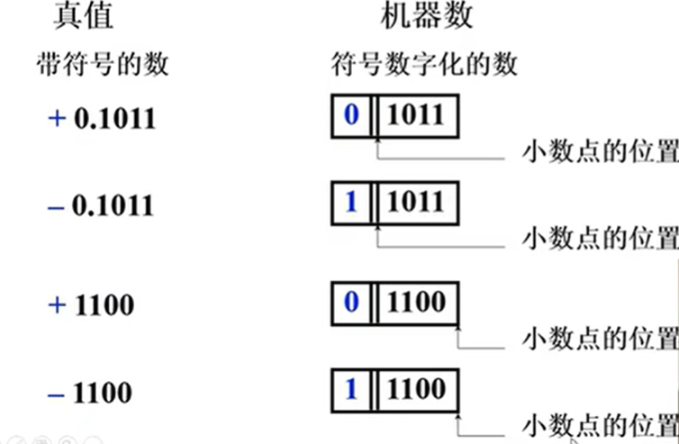
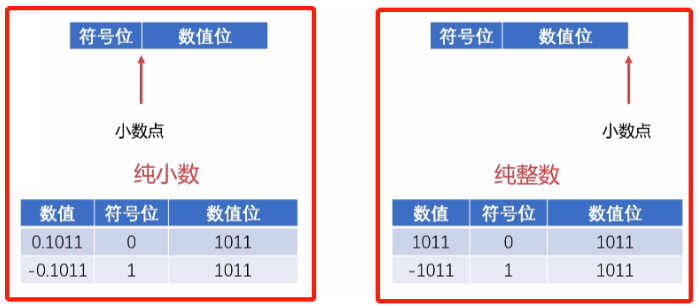
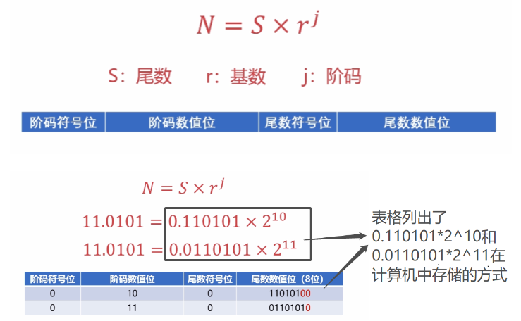

# 1. 无符号数和有符号数
## 1.1. 无符号数
没有正负号的数，寄存器的位数反应无符号数的表示范围。如，8位寄存器表示的无符号数表示范围为0~255。
## 1.2. 有符号数
有符号数包括符号位和数据位两部分。
### 1.2.1. 机器数与真值
  
真值：带符号的数，+0.1011 
机器数：符号数字化的数  0 1011，起始的0为符号位
 

# 2. 数的定点表示和浮点表示
小数点固定在某个位置的数，称为定点数。下方两张图片展示了纯整数和纯小数的定点数表达：  
  

若不是纯小数也不是纯整数，这个时候就需要乘以一个比例因子以满足定点数保存格式，如：
10.02表示为：0.1002*10^2

浮点数：小数点的位置由阶码规定，因此小数点的位置是不固定的，是浮动的。用来表示实数。  

计算机表示浮点数时也跟科学计数法一样有尾数、基数、阶码的概念。对于任意的浮点数N，都可以使用公式$$N = S * r^J$$来表示，如下图:  
  

可以发现，阶码和尾数的二进制表示个数可以自定义的，阶码使用的二进制越多，表示的数值就可以越大，但是其精度就会下降，因为表示小数部分的尾数的二进制个数减少了；而尾数使用的二进制越多，表示的数值的精度就可以越精细，但是其表示数值的最大值就会减小，因为表示阶码部分的二进制个数减少了。两者是处于相互矛盾抑制。
  
# 3. 定点运算

# 4. 浮点四则运算