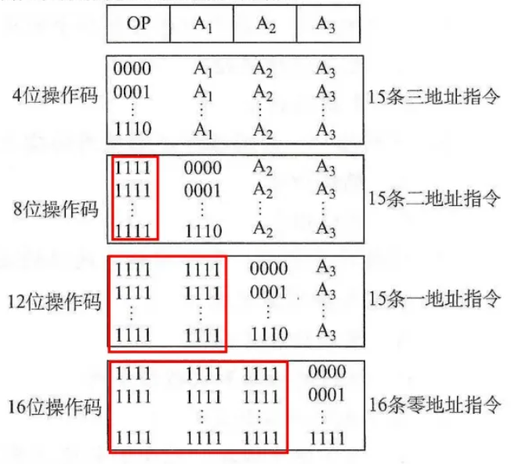
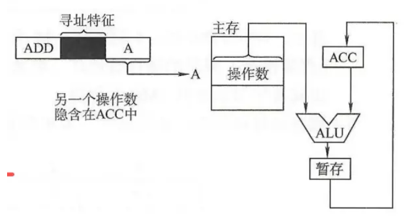
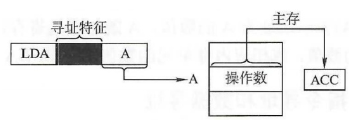
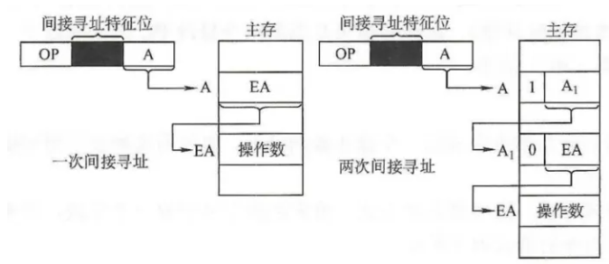
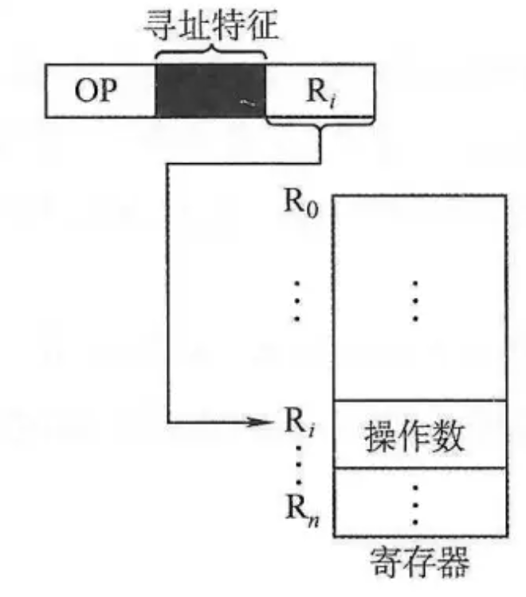
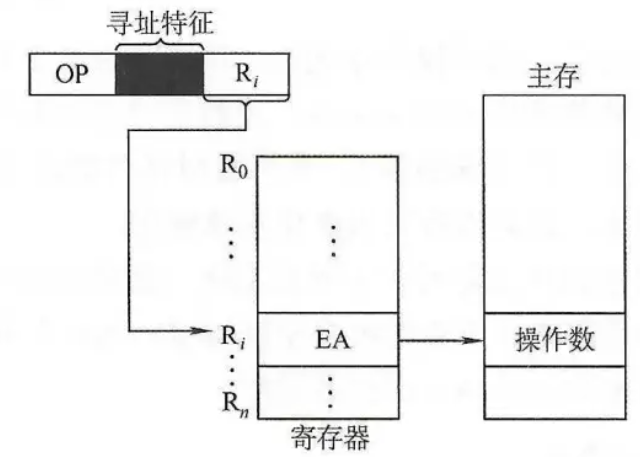
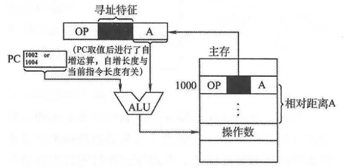
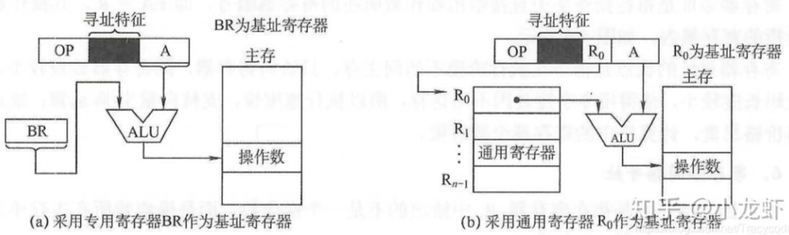
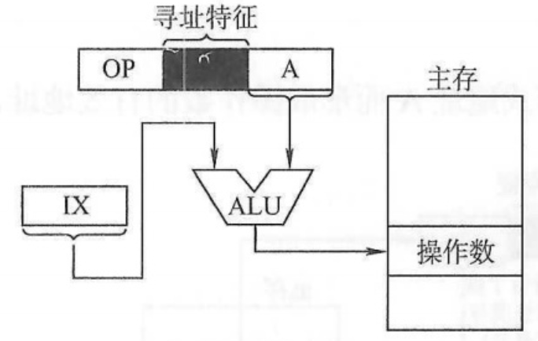

- 指令（又称机器指令）是指示计算机执行某种操作的命令，是**计算机运行的最小功能单位**。
- 一台计算机的所有指令的集合构成该机的指令系统/指令集
- 指令系统是计算机的主要属性，位于硬件和软件的交界面上。也可以说指令系统是计算机硬/软件的界面

# 1. 指令格式
## 1.1. 指令的基本格式
|操作码字段|地址码字段|
|:-:|:-:|


- **操作码**：指出指令中该指令应该执行什么性质的操作和具有何种功能。
- **地址码**：给出被操作的信息（指令或数据）的地址。

在一个指令系统中，若所有指令的长度都是相等的，则称为定长指令字结构。定字长指令的执行速度快，控制简单。若各种指令的长度随指令功能而异，则称为变长指令字结构。

## 1.2. 指令按地址数量分类
#### 零地址指令
```零地址 OP ```
|OP|
|:-:|

适用情况：
- 不需要操作数的指令
- 操作数从栈顶和次栈顶弹出
#### 一地址指令
```OP A1```
|OP|A1| 
|:-:|:-:|

适用情况：
- 单操作数指令，```OP(A1) --> A1```
- 有两个操作数，但另一个操作数由累加器ACC提供，结果也放在ACC中：```(ACC)OP(A1) --> ACC```
#### 二地址指令
| OP|A1 |A2|
|:-:|:-:|:-:|

A1是目的操作数，保存运算结果：```(A1)OP(A2) --> A1```

#### 三地址指令
| OP|A1 |A2|A3（结果）|
|:-:|:-:|:-:|:-:|

```(A1)OP(A2) --> A3```

#### 四地址指令
| OP|A1 |A2|A3（结果）|A4（下址）|
|:-:|:-:|:-:|:-:|:-:|

(A1)OP(A2)——>A3，A4是下一条指令的地址

## 1.3. 变长操作码的指令格式
为了在指令字长有限的前提下仍保持比较丰富的指令种类，可采取可变长度操作码，即全部指令的操作码字段的位数不固定，且分散地放在指令字的不同位置上。显然，这将增加指令译码和分析的难度，使控制器的设计复杂化。

操作码的位数随地址数的减少而增加：



注意以下两点∶
- 不允许短码是长码的前缀，即短操作码不能与长操作码的前面部分的代码相同
- 各指令的操作码一定不能重复

通常情况下，对使用频率较高的指令分配较短的操作码，对使用频率较低的指令分配较长的操作码，从而尽可能减少指令译码和分析的时间。

# 2. 指令的寻址方式
地址码也分两种：

- 形式地址：指令中的地址码字段并不代表操作数的真实地址，表示为(A)。
- 有效地址：形式地址结合寻址方式，可以计算出操作数在存储器中的真实地址，也就是有效地址，表示为(EA)。


指令系统中采用不同的寻址方式的目的：
- 缩短指令字长
- 扩大寻址空间
- 提高编程灵活性

与此同时，指令译码的难度则增加了

#### 指令寻址和数据寻址
##### 指令寻址：寻找下一条将要执行的指令的地址，通过程序计数器PC给出
- 顺序寻址：程序计数器PC+1自动形成下一条指令的地址
- 跳跃寻址：通过**转移类指令**实现，由本条指令给出下一条指令的地址的计算方式，得到地址偏移量/相对地址或者绝对地址。跳跃的结果是当前指令修改PC值，可以实现程序的无条件转移和条件转移。

##### 数据寻址：寻找操作数的地址。由寻址特征指出寻址方式，结合形式地址A，得出操作数的有效地址EA

## 2.1. 常见的数据寻址方式
|寻址方式|有效地址|访存次数|
|:-:|:-:|:-:|
|隐含寻址|程序指定|0|
|立即寻址|A即是操作数|0|
|直接寻址|EA=A|1|
|一次间接寻址|EA=(A)|2|
|寄存器寻址|EA=R1|0|
|寄存器间接一次寻址|EA=(R1)|1|
|相对寻址|EA =（PC）+A|1|
|基址寻址|EA =（BR）+ A|1|
|变址寻址|EA = （IX）+A|1|

### 2.1.1. 隐含寻址
- 优点：有利于缩短指令字长，**简化地址结构**
- 缺点：需增加存储操作数或隐含地址的硬件



### 2.1.2. 立即（数）寻址
地址字段指出的不是操作数的地址，而是操作数本身，又称**立即数**

- 优点：指令在执行阶段**不访问主存**，指令执行时间最短
- 缺点：A的位数限制了立即数的范围

### 2.1.3. 直接寻址
指令字中的形式地址A是操作数的真实地址EA，即EA=A
- 优点：简单，指令在执行阶段仅访问一次主存，不需要专门计算操作数的地址
- 确定：A的位数决定了该指令操作数的寻址范围，操作数的地址不易修改



### 2.1.4. 间接寻址
指令的地址字段给出的形式地址不是操作数的真正地址，而是**操作数有效地址所在的存储单元的地址**，也就是操作数地址的地址，即EA=(A)

- 优点：可扩大寻址范围（有效地址 EA的位数大于形式地址A的位数），便于编制程序（用间接寻址可方便地完成子程序返回）
- 缺点：指令在执行阶段要多次访存，速度过慢，一般问到扩大寻址范围时，通常指的是这种方式


### 2.1.5. 寄存器寻址
寄存器寻址是指在指令字中直接给出操作数所在的寄存器编号，即 EA=Ri，其操作数在由Ri所指的寄存器内

- 优点：指令在执行阶段不访问主存，只访问寄存器，因寄存器数量较少，对应地址码长度较小(可有效缩短指令中某个地址段的位数)，使得指令字短且因不用访存，所以执行速度快
- 缺点：寄存器价格昂贵，计算机中的寄存器个数有限



### 2.1.6. 寄存器间接寻址
寄存器间接寻址是指在寄存器 Ri中给出的不是一个操作数，而是操作数所在主存单元的地址，即EA=(Ri)。与一般间接寻址相比速度更快



### 2.1.7. 相对寻址
把程序计数器的内容加上指令格式中的形式地址A而形成操作数的有效地址，EA=(PC)+A

- 优点：操作数的地址不是固定的，它随PC值的变化而变化，且与指令地址之间总是相差一个固定值，因此便于程序浮动。相对寻址广泛应用于**转移指令**。对于多道程序设计来说最重要



### 2.1.8. 基址寻址（面向系统）
基址寻址是指将CPU中**基址寄存器**的内容加上指令格式中的形式地址A而形成操作数的有效地址，即EA=(BR)+A。其中基址寄存器既可采用专用寄存器，又可采用通用寄存器  

- 优点：可扩大寻址范围（基址寄存器的位数大于形式地址A的位数），有利于多道程序设计，并可用于编制浮动程序，但偏移量（形式地址A）的位数较短



### 2.1.9. 变址寻址（面向用户）
变址寻址是指有效地址EA等于指令字中的形式地址A与**变址寄存器IX**的内容之和，即 EA=(IX)＋A，其中IX为变址寄存器（专用），也可用通用寄存器作为变址寄存器

- 优点：可扩大寻址范围；有利于数组处理，特别适合编制循环程序



### 2.1.10. 堆栈寻址

寄存器堆栈又称硬堆栈。寄存器堆栈的成本较高，不适合做大容量的堆栈；而从主存中划出一段区域来做堆栈是最合算且最常用的方法，这种堆栈称为软堆栈。

在采用堆栈结构的计算机系统中，大部分指令表面上都表现为无操作数指令的形式，因为操作数地址都隐含使用了SP。通常情况下，在读/写堆栈中的一个单元的前后都伴有自动完成对SP内容的增量或减量操作