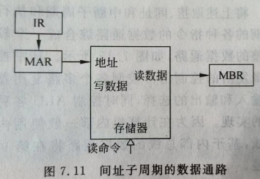

# 1. 控制器概述
## 1.1. 控制器的功能
- 取指令
- 分析指令
- 执行指令，发出各种操作命令
- 总线管理
- 处理中断、异常等特殊情况

  

## 1.2. 指令周期
**计算机读取并执行完一条指令的全部时间，称为指令周期**

指令周期大体可以分成四个阶段
- 取指周期: 从内存中取得指令，并分析指令。
- 间址周期: **间接寻址**的指令都包含间址周期。发出指令中的形式地址，从内存中读回有效地址。
- 执行周期: 除空操作以及 NOP 指令外，所有指令都包括执行周期，用以完成指令的主要功能。
- 中断周期: 如果在前面三个过程中有设备发出了中断请求，则在执行完上述三个周期后，执行中断隐指令

**注意**：并不是每一条指令都包括完整的四个阶段

## 1.3. 机器周期
**指令执行的每个阶段，称为一个机器周期，也称为工作周期**

##### 如何确定机器周期的长度
- 每条指令的执行步骤
- 每一步骤所需的时间
- 以完成最复杂、最慢指令功能的时间为准
##### 统一机器周期的确定
- 计算机中，最慢指令为访存指令，因此**以一次访存所需时间作为机器周期**
- 若“指令字长=存储字长”，则“访存周期=机器周期”
## 1.4. 时钟周期
- **将一个机器周期分为若干个时间相等的时间段，每段称为一个时钟周期**。（节拍、状态）
- 时钟周期是控制计算机操作的最小时间单位
- 用时钟周期控制微操作命令，每个时钟周期产生一个或几个微操作命令
常用$T_0$，$T_1$，$T_2$，$T_3$来描述时钟周期

##### 时钟周期的产生方法
使用计数器和译码器来控制每次执行的微操作


## 1.5. 指令周期、机器周期和时钟周期的关系
指令周期、机器周期、时钟周期（节拍、状态）组成多级（三级）时序系统

一个机器周期内包含若干时钟周期，包含时钟周期的个数称之为机器周期的时间宽度。

如果每个机器周期的时间宽度相等，称为**定长机器周期**；如果不相等，称为变长机器周期。


# 2. 指令周期的操作命令分析
## 2.1. 取指周期
* PC保存了下一条指令在内存单元的地址，PC -> MAR -> 地址总线
* 控制器发出一条存储器读命令，存储器将该地址存放的数据放到数据总线上，并锁存到MDR
* MDR -> IR
* PC+1 -> PC

 

## 2.2. 间址周期
取指周期结束后，控制器检查IR内容，确定是否需要一个使用间接寻址的操作数指定器，若需要，一个间址周期被执行

* 将指令中的地址部分送到MAR ： Ad(IR) -> MAR
* 控制器发出一条存储器读命令
* 存储器将该地址存放的数据放到地址线上，并锁存到MDR
* 将数据写回到指令的地址部分 ： MDR -> Ad(IR)



## 2.3. 执行周期
#### 非访存指令
指令的执行阶段，都不会访存到存储器
* CLA：清零指令，微操作是 0 -> ACC，将累加器清0
* COM：取反指令，微操作是将累加器内容按位取反
* SHR：算术右移
* CSL：循环左移
* STP：停机指令，微操作是 0 -> G，一旦控制信号有效，机器就会停止
#### 访存指令
##### 加法指令（ADD X）
* 将指令的地址部分送到 MAR：Ad(IR) -> MAR
* 控制器发出一条存储器读命令
* 将加法所需数据从内存读出：M(MAR) -> MDR
* 与ACC寄存器中的数据相加，结果保存到ACC寄存器：(ACC) + (MDR) -> ACC

##### 存数指令（STA X）
* 将指令的地址部分送到MAR：Ad(IR) -> MAR
* 控制器发出一条存储器写命令
* 控制器将待写的数据（ACC中）放入MDR：ACC -> MDR
* 将MDR上的数据写入主存中MAR寄存器所指定的内存位置上：MDR -> M(MAR)

##### 取数指令（LDA X）
* 将指令的地址部分送到MAR：Ad(IR) -> MAR
* 控制器发出一条存储器读命令
* 从存储器中MAR所指定的内存位置上读出数据，放到MDR
* 将数据写入累加器：MDR -> ACC

##### 无条件转移指令 （JMP X）
* 将跳转地址赋给PC ： Ad(IR) -> PC

## 2.4. 中断周期
1. 保存断点
中断隐指令中需要保存断点，通常断点都保存在内存的 0 号单元中。

    * CU 传 0 到 MAR，作为断点保存地址
    * 控制器发出一条存储器写命令
    * 将即将要执行的指令地址送到 MDR，PC 中的内容就是断点： PC -> MDR
    * 将断点写入内存中：MDR -> M(MAR)

2. 执行中断处理程序（PC跳转）
    * 中断向量地址 -> PC

3. 硬件关中断
    * 将中断总允许位置0： 0 -> EINT

# 3. 流水线技术
将一个重复的过程分解成若干子过程，每个子过程与其他子过程并行执行。由于流水线技术只需增加少量硬件就能把计算机运行速度提高几倍，故而广泛用于并行处理


#### 流水线的主要特点：
* 流水过程由多个相联系的流水段组成，每个流水段称为流水线的“级”或“段”，流水线的段数也称为流水线的**深度**或**流水深度**，每个流水段由专用的功能部件实现
* 每个功能段所需时间应尽量相等，否则时间长的功能段将成为流水线的瓶颈，会造成**流水线堵塞或断流**，这个时间一般为一个时钟周期或机器周期
* 流水线需要有**通过时间**（第一个任务流出结果所需的时间），在此之后，流水过程才进入稳定工作状态，每一个时钟周期流出一个结果
* 流水技术适合于大量重复的时序过程，只有输入端能连续地提供任务，流水线的效率才能充分发挥

**流水线设计原则**：流水段的长度以花费时间最长的阶段为准。

为了进一步提高处理速度，需将指令的处理过程分解为更细的几个阶段:
- 取指（FI）：从存储器取出一条指令并暂时存入指令部件的缓冲区。
- 指令译码（DI）：确定操作性质和操作数地址的形成方式。
- 计算操作数地址（CO）：计算操作数的有效地址，涉及到寄存器间址、间址、变址、基址、相对寻址等各种地址计算方式。
- 取操作数（FO）： 从存储器中取操作数(若操作数在寄存器中，则无需此阶段)。
- 执行指令（EI）：执行指令所需的操作，并将结果存于目的位置(寄存器中)。
- 写操作数（WO）：将结果存入存储器。

为了说明方便起见，假设上述各段的时间都是相等的，于是可得下图所示的指令六级流水时序。在这个流水线中，处理器有六个操作部件，同时对六条指令进行加工，加快了程序的执行速度。


图中假设每条指令都经过流水线的六个阶段，但事实并不总是这样。如取数指令并不需要WO阶段。此外，这里还假设不存在存储器访问冲突，所有阶段均并行执行。如**FI、FO和WO阶段都涉及存储器访问**，如果出现冲突就无法并行执行

### 3.2. 流水线的冒险
#### 3.2.1 数据冒险（数据冲突）
数据相关指在一个程序中，存在必须等前一条指令执行完才能执行后一条指令的情况，则这两条指令即为数据相关

解决办法：
- 数据旁路技术（转发机制）：不等前一条指令把计算结果写回寄存器组，下一条指令不再读寄存器组，而是直接把前一条指令的计算结果作为自己的输入数据开始计算过程
- 暂停流水线：把遇到数据相关的指令及其后续指令都暂停一至几个时钟周期，直到数据相关问题消失后再继续执行。可分为硬件阻塞（stall）和软件插入“NOP”两种方法
- 编译优化：通过编译器调整指令顺序来解决数据相关

数据冒险的分类：
* 写后读（RAW）相关：按序发射，按序完成时，只可能出现RAW相关
```
// R5 发生冲突
I1：ADD R5，R2，R4      (R2)+(R4) -> R5 // 往 R5 写入
I2：ADD R4，R5，R3      (R5)+(R3) -> R4 // 从 R5 读出
```
* 写后写（WAW）相关：存在多个功能部件时，后一条指令可能比前一条指令先完成
```
// I2 可能比 I1 先完成，导致 R3 最后存储的是 (R2)*(R1) 的结果，而不是 (R4)-(R5) 的结果
I1: MUL R3，R2，R1      (R2)*(R1) -> R3
I2: SUB R3，R4，R5      (R4)-(R5) -> R3
```
#### 3.2.2. 结构冒险（资源冲突）
由于多条指令在同一时刻争用同一资源而形成的冲突称为结构相关

解决办法：
- 暂停流水线：后一相关指令暂停一个时钟周期
- 资源重复配置：数据存储器 + 指令存储器

#### 3.2.3. 控制冒险
当流水线遇到**转移指令**和**其他改变 PC 值的指令而造成断流**时，会引起控制相关

解决办法：
- 转移指令分支预测：简单预测（永远猜 true 或 false）、动态预测（根据历史情况动态调整）
- 预取转移成功和不成功两个控制流方向上的目标指令
- 加快和提前形成条件码
- 提高转移方向的猜准率

# 4. 高级流水线技术
* 时间上的并行技术：流水线技术
* 空间上的并行技术：超标量技术
## 4.1. 超标量技术
- 每个时钟周期内可并发多条独立指令，不能调整指令的执行顺序
- 要配置多个功能部件，通过编译优化技术，把可并行执行的指令搭配起来
## 4.2. 超流水技术
- 在一个时钟周期内再分段（继续细分，比如再分为 3 段），在一个时钟周期内一个功能部件使用多次（使用 3 次）
- 不能调整指令的执行顺序，靠编译程序解决优化问题

## 4.3. 超长指令字
由编译程序挖掘出指令间潜在的并行性，将多条能并行操作的指令组合成一条
具有多个操作码字段的超长指令字（可达几百位），采用多个处理部件

# 5. 时序控制
时序部件：产生指令周期中各时序信号的逻辑电路


- **时钟源**：时钟脉冲信号
- **节拍脉冲发生器**：顺序脉冲发生器，以CLK为基，连续不断的产生一组有序的、间隔相等或不等的环形脉冲序列
- **机器周期信号产生器**：顺序脉冲发生器，机器周期的个数，可能因为指令的不同而不同，比较适合计数器和译码器电路的实现
- **启停控制逻辑电路**：准确可靠的开启或封锁计算机工作时钟，控制微操作命令序列的产生或停止，启动或停止计算机的运行

**单周期CPU**：每条指令均在一个时钟周期内完成

- 所有指令的执行时间等长：一个时钟周期，CPI = 1
- 各个部件一般采用直接相连，且操作结果直接送入下一个部件，无需暂存，以保证在单周期内结果就可正确产生，在单周期的后沿打入目的寄存器

分析：单周期CPU实现简单，但是性能低效，CPU执行时间 = 程序指令数 × CPI × 时钟周期，时钟周期由执行时间最长的指令决定（RISC CPU一般是lw），故现代计算机并不采用单周期CPU

**多周期CPU**：每条指令都需要多个时钟周期才能完成

- 不同指令所占用的时钟周期可能不同，CPI > 1
- 每个阶段就是一个时钟周期，时钟周期由操作时间最长的阶段决定
- 时钟周期可大大缩短，CPU主频大大提高，无空耗时间
- 功能部件可在指令周期中共享，但需要暂存每次操作的结果
- 部件连接方式为总线连接或直接连接，存储器采用普林斯顿结构
- 总体运行时间更短（效率更高），但硬件更复杂（需要更多暂存器）

**流水线CPU**：在多周期CPU基础上，将各个部件按顺序组成一条流水线，指令源源不断进入流水线，经各个部件顺序处理后流出流水线

经典五级流水线结构：每个阶段对应独立的部件，可同时为5条指令服务，需要在各个阶段之间插入锁存器，流水线时钟周期要采用各个阶段中操作时间最长的阶段为准